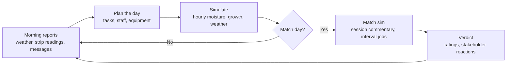
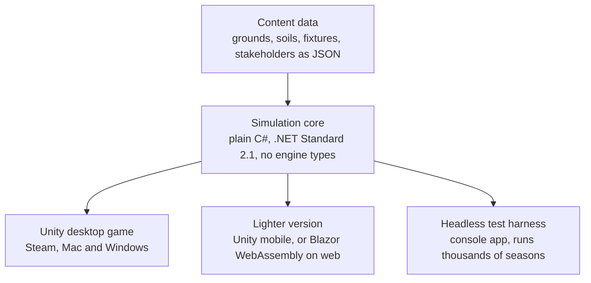

# Cricket Groundsman Simulator: Game Design & Technical Decisions

Sep 26, 2026 · @James Fry

## Vision and pillars

A Football Manager-style management sim where you prepare and look after a cricket ground. You make daily decisions, the simulation runs, and matches deliver a public verdict on your work. There is no direct control of players or play.

The square is your squad. Each strip behaves like a player: it has hidden attributes, condition, wear, recovery time and a reputation. Rotating strips across a fixture list is the central puzzle.

**Pillars**

- **Conflicting pressure.** Captain, board, broadcaster and governing body want different things. Good seasons come from choosing who to disappoint.
- **Delayed consequences.** A rushed end repair or a loam change can surface weeks or seasons later.
- **Expertise as clarity.** Skill and tools let you read the ground more precisely, rather than making you stronger.
- **Authentic craft.** Real groundskeeping processes, grounded in the research phase, with enough abstraction to stay playable.
- **Stories from systems.** The best moments come from simulation: the pitch that cracked on day four, the washout you saved with the covers.

## Core loop

One in-game day is the basic unit: read reports, set tasks, assign staff, advance time. Match days switch to a session-by-session view with commentary tied to pitch behaviour.

**Variable pace.** Turns get shorter as a match approaches, so quiet periods move fast and the tense moments get detail.

| Period | Turn length |
| --- | --- |
| Off-season and winter renovation | A week |
| Normal in-season days | A day |
| Final days of a strip's preparation | Morning and afternoon |
| Match day | Session by session, with interval windows |

The simulation underneath always runs hourly, so only the player's decision points change.

### Outside pressures

| Stakeholder | Typical demand | Conflicts with |
| --- | --- | --- |
| Captain and coach | Season style, e.g. green seamers in April while the overseas quick is here | Board, governing body |
| Board and finance | Matches that last four days for gate and hospitality income | Captain wanting results |
| Broadcaster | Test matches into days four and five, big T20 totals | Seam-friendly pitches |
| Governing body | Fair, consistent pitches with no dangerous bounce | Home-advantage requests |
| Members and public | A tidy ground, cricket on time, no washouts | Renovation work in season |

Inputs each day also include the fixture list (format, opposition attack), a forecast whose reliability depends on skill, and the budget for loam, seed, fuel, staff and repairs.

### The payoff screen

Match results come as a text feed about the pitch: the ball keeping low from one end, dust on day three, the referee inspecting at lunch. Pitch maps and bounce heatmaps show where the ball landed and how it behaved.

## The square and strip model

A square holds 12 to 20 strips, each with its own state. Every fixture burns a strip for weeks, so allocation is a season-long plan, not a weekly choice.

| Layer | Examples | Visible to the player? |
| --- | --- | --- |
| Hidden attributes | Clay content, root depth, thatch, layering from past top-dressing | Only through soil cores and skill |
| Condition | Moisture profile, grass cover and height, hardness, cracking | Approximate early, precise later |
| Wear | Crease-area damage, follow-through rough, run-up wear at the ends | Yes, as damage maps |
| History | Last used, match type, end-repair quality, recovery progress | Yes |
| Reputation | How it has played before, as remembered by players and press | Yes, as text |

### Allocation rules that create decisions

- Prestige matches want the centre strips for even boundaries and broadcast angles.
- T20s may want an off-centre strip for a short boundary, and a good sightline.
- Using a strip wears the square's ends through run-ups, so neighbours lose some future value.
- Second XI, women's fixtures, club hires and practice all need strips too.
- Late-season strips must recover before autumn renovation or they carry damage into next year.

### Preparation and recovery

Each strip runs its own preparation cycle of about ten days: watering, rolling, mowing down, and a final roll. Several cycles overlap at once. After a match the ends are repaired, seeded and covered to germinate, and recovery time becomes a resource the player spends.

## Pitch behaviour and scoring

Pitch quality is several readings, not one number, and how they change over a match matters as much as day one. The classic target for a Test: seam on day one, batting on days two and three, spin and variable bounce on days four and five.

| Characteristic | Main drivers |
| --- | --- |
| Pace | Hardness, compaction, dryness |
| Bounce height | Clay content, compaction, moisture |
| Bounce consistency | Evenness of moisture and compaction, cracks, footholes. Inconsistency earns demerits |
| Carry | Pace and bounce together |
| Seam movement | Grass cover and surface moisture |
| Spin and grip | Dry surface, crumbling, cracks, rough |
| Cracking | Fine cracks are fine; cracks where the plates move are dangerous |

### Footholes and rough

Where damage forms:

- **Front-foot landing zone** around the popping crease takes the most, back-foot landing less. Heavy fast bowlers dig deeper.
- **Follow-through rough** lands wide of the protected area. Its side depends on bowling arm, over or round the wicket, and batter handedness. Model it from the actual bowlers in each XI.
- **Batters' marks** from taking guard, crease movement and running on the pitch.
- **Run-ups** wear the square's ends and the outfield approach, badly when wet.
- **Wet play** multiplies all of the above.

What makes a surface resist it, all things the player controls: clay content and binding, rolling and compaction, starting moisture (too wet sinks, too dry dusts), root density, thatch, layering, and the quality of earlier end repairs.

### Scoring layers

| Layer | Measures |
| --- | --- |
| Per match | Pitch rating, outfield rating, spectacle (runs, days lasted, a result), each stakeholder's satisfaction |
| Per season | Square health, budget, reputation, team results, awards |
| Career | Reputation, job offers, access to bigger venues and overseas contracts |

The ratings model follows the ICC scale and demerit system from the research file. The layers should pull against each other: a top rating on a pitch that cost your team the title should sting.

## Minigames

Every minigame is optional and can be delegated to staff, who auto-resolve it based on their skills. Playing it yourself gives a skill-based bonus over the delegated result.

| Minigame | What you do | Pressure |
| --- | --- | --- |
| Covers race | Direct a crew to cover the square, run-ups and ends in priority order | Rain radar, crew fitness and experience |
| Super Sopper drying | Route the machine across the wettest outfield patches | The umpires' next inspection time |
| Interval repairs | Fill and tamp footholes between sessions | Clock, and what umpires permit |
| Between-innings roll | Run the roller the batting captain picked | Time limit |
| Marking out | Paint creases accurately | Precision |
| Mowing stripes | Cut presentation stripes on the outfield | Feeds the presentation score only |

Open question: the exact rules on foothole repair during a match need checking against Law 9 before the repair minigame is designed.

## Progression

You start low in the hierarchy, which doubles as the tutorial: the boss hands you tasks and each system arrives one at a time. Two starting modes give different early games.

- **Club volunteer.** You do everything at a village or league club with no budget, an old roller and a committee.
- **County apprentice.** A narrow role at a professional ground under a head groundsman, with good kit and little authority.

The ladder: casual groundstaff, assistant, deputy head, head groundsman, head of grounds at a Test venue, then consultant roles for touring sides or a governing body.

### Specialisms

| Track | Skills | Payoff |
| --- | --- | --- |
| Square | Soil reading, rolling, moisture judgement | Better pitch character control |
| Outfield and turf | Drainage, disease, pests, renovation | Faster outfields, fewer washouts |
| Machinery | Maintenance, repair | Lower running costs, fewer breakdowns |
| Match operations | Weather reading, covers crew, logistics | More play saved, better forecasts |
| Management (later) | Staff, budget, board politics, media | Bigger venues and budgets |

### Information quality as reward

Early on you can't see a strip's true state. You get "feels damp underneath" from a screwdriver and a thumb press. Skills and tools sharpen this into moisture probe readings, Clegg hammer hardness values and soil cores showing roots and layering.

This is the proposed signature mechanic: expertise shows up as clarity. It needs testing early because it shapes the whole UI.

**Certainty ranges.** Every reading is shown as a range, not a single value: "moisture 18 to 26%" rather than "22%". Four sources narrow the range, so upgrading information has several routes.

| Source | What it controls | Example |
| --- | --- | --- |
| Tools | What can be measured at all, and the best possible precision | Screwdriver gives wet, damp or dry; a moisture probe gives a % band; a Clegg hammer adds hardness |
| Staff | Who takes the reading, and how many strips get read each day | A skilled deputy reads tighter than a casual; more staff keeps more readings fresh |
| Personal experience | Your skill in each area, from the specialism tracks | High soil reading narrows moisture and hardness ranges |
| Ground familiarity | A per-ground knowledge %, rising each season you work there | Moving to a new ground widens everything again, so job offers carry a real cost |

Readings also age: a range widens each day after it was taken, faster in changeable weather. Forecasts use the same rule. Football Manager's scouting knowledge, where attribute ranges narrow as scouts cover a region, is a close precedent.

### Equipment

| Category | Progression |
| --- | --- |
| Rollers | Light, medium, heavy |
| Mowers | Cylinder for the square, rotary or gang for the outfield |
| Surface tools | Scarifiers, verticutters, brushes, drag mats, spikers |
| Covers | Flat sheets, raised covers, hover covers |
| Drainage and drying | Super Sopper, then sub-surface air drainage |
| Late game | Grow lights, drop-in pitches |

Loam choice is a strategic decision, not an upgrade. More clay gives pace and bounce but cracks more. Switching loam risks layering that can show up two seasons later.

### Events and long-term hooks

- Pests: chafer grubs and leatherjackets, then crows and badgers digging for them
- Turf disease, fairy rings, worm casts
- Joyriders on the outfield, a fete wanting the square for a bouncy castle
- Press accusing you of doctoring a pitch after a home win
- Job offers, staff who develop or leave, multi-season square rebuilds, groundsman of the year awards

## Grounds and expansions

England and Wales is the base game: constant rain keeps the covers drama going, and the short season with green early pitches gives the calendar shape.

### Venue types

| Venue | Character |
| --- | --- |
| Village green | Common land, dog walkers, one volunteer |
| League club | Small committee, tight budget |
| School ground | Huge fixture volume, almost no money |
| County ground | Headquarters square plus festival outgrounds |
| Test venue | Main square, practice squares, nets |
| Multi-use stadium | Winter football or rugby, drop-in pitches |

### Continent packs

Each pack brings a different core problem, not just new art.

| Pack | Core problem |
| --- | --- |
| Australia | Drop-ins at multi-sport stadiums, heat and cracking, pink-ball Tests needing more grass |
| Indian subcontinent | Red versus black soils, home-board pressure for turners against demerit risk, dew, monsoon timing |
| South Africa | Highveld altitude bounce, water rationing (a Cape Town drought scenario) |
| Caribbean | Slow low pitches, hurricane season, tiny budgets at historic grounds |
| New Zealand | Grounds shared with rugby, green seamers, wind |
| UAE and neutral venues | Extreme heat, desalinated water, hosting other nations' home series |

### Challenge scenarios

One-off scenarios based on real situations, such as the 2024 T20 World Cup venue in New York: drop-ins grown overseas, a temporary stadium, no time to settle, and global scrutiny.

Scenarios use fictional names but are inspired by real incidents. Some ask you to rescue a disaster in the making; others let you deliberately recreate a notorious pitch for fun.

| Scenario | Inspired by | Goal |
| --- | --- | --- |
| The Relaid Square | The Caribbean Test abandoned within an hour in the late 1990s after the pitch was judged dangerous | Rescue: get a freshly relaid, unsettled square through a Test without an abandonment |
| Sand in the Run-ups | The Caribbean Test called off after a handful of balls in 2009 because the outfield run-ups were unsafe | Rescue: make an outfield safe in days, or organise a switch to a second ground |
| The Unplayable ODI | A one-day international in India abandoned mid-match for dangerous bounce | Rescue: diagnose why a strip is misbehaving before match day |
| Drop-ins From Overseas | The 2024 T20 World Cup venue in New York | Rescue: settle imported drop-ins in time |
| Minefield Mode | Notorious raging turners and green tops | Recreate: produce the most extreme pitch you can without being banned |

Surface details for each incident still need checking in the research phase before scenarios are written.

## Technical decisions

Recommendation: write the simulation as a plain C# library with no engine dependency, and put a Unity 6 front end on it for desktop. The lighter web or mobile version then reuses the same simulation with a smaller ruleset and a new UI.

### Architecture

The simulation core owns the calendar, weather, soil and strip state, stakeholders and match results. The front end only renders state and sends player commands. A headless harness can then run thousands of simulated seasons to balance the game, without opening an engine.

### Decisions to make now

| Decision | Recommendation | Why |
| --- | --- | --- |
| Simulation core | Plain C# class library targeting .NET Standard 2.1 | Unity, Godot and Blazor can all host it. Your .NET background fits directly |
| Presentation engine | Unity 6 | C# throughout, solid Mac editor, builds for Steam, iOS, Android and web |
| Primary platform | Mac and Windows on Steam | Dense management UIs suit mouse, keyboard and large screens |
| Time model | Hourly simulation underneath, with player turns from a week down to a session as a match approaches | Predictable, testable, easy to fast-forward |
| Determinism | Seeded random numbers, no engine clock inside the simulation | Reproducible bugs, replays, balancing runs |
| Content | Data files for grounds, soils, loams, fixtures, stakeholders | Expansions become data packs; modding later |
| Save format | Versioned JSON with migrations, or SQLite if data grows | Saves survive updates |
| Visual style | 2D top-down or isometric | Cheap to produce; covers every minigame |
| Licensing | Fictional counties, grounds and players, written with plenty of personality (decided) | Avoids licensing, and characterful people and places offset a dry subject. Art and aesthetics decided later |
| Units and spelling | Metric with yards for the pitch, British spelling | Matches how the sport is described |

### Engine options compared

| Option | Strengths | Risks |
| --- | --- | --- |
| Unity 6 | C#, mature UI tools, every target platform | Free Personal plan only while total annual revenue and funding stay at or below $200,000 ([Unity terms](https://unity.com/legal/editor-terms-of-service/software)); web builds are heavy |
| Godot 4 (C#) | Free, open source, light editor | C# projects can't officially export to web yet; a prototype exists but hadn't shipped as of late 2025 ([Godot forum](https://forum.godotengine.org/t/is-there-an-update-on-exporting-c-projects-to-web/128821)) |
| Web tech (Blazor or TypeScript) wrapped for Steam | Web and mobile come naturally; UI-heavy games suit HTML | Weaker for minigames and animation; desktop wrapper adds work |

Unity 6 no longer has a runtime fee; projects built with it are distributed royalty-free under the current terms ([Unity terms](https://unity.com/legal/editor-terms-of-service/software)).

### The lighter version

Football Manager already does this with its mobile and touch editions, so the model is proven. The lighter game would run one ground, strip-level decisions and shorter seasons, on the same simulation core.

Two ways to ship it:

1. **Unity mobile build** for iOS and Android, sharing most UI code with desktop.
2. **Blazor WebAssembly** for a browser version. It hosts the C# core natively and suits an interface built from menus and tables.

Unity's own web export works too, but downloads are large and mobile browsers struggle with it.

### Mac workflow

- **IDE:** JetBrains Rider or VS Code with the C# extensions. Visual Studio for Mac has been retired.
- **Windows testing:** Unity builds Windows players from a Mac, but you need a real Windows machine or VM to test them.
- **Apple distribution:** an Apple Developer account is needed for iOS and for signing and notarising Mac builds. Xcode on your Mac handles iOS builds, which is an advantage.
- **Version control:** Git with LFS for art and audio.

### Constraints to respect in the core

- Keep to C# language features Unity supports, which lag behind current .NET.
- No Unity or Godot types in the simulation, not even vectors or random number generators.
- All randomness goes through one seeded source so any season can be replayed exactly.

## Vertical slice and open questions

The first playable should prove one thing: rotating strips while balancing pressures is fun. If it isn't fun at this size, more content won't fix it.

**In the slice**

- One county ground, one season, a square of 12 strips
- A fixture list with three formats
- Three stakeholders: captain, board, match referee
- Weather with an imperfect forecast
- The information-quality mechanic at two levels (rough feel and a moisture probe)
- Text commentary match results with a pitch rating

**Out of the slice:** minigames, career progression, equipment upgrades, other venues and continents.

### Build order

1. Strip data model and daily tick in the C# core, driven from a console app.
2. Weather and moisture simulation, balanced with headless season runs.
3. Match result model: pitch state in, commentary and rating out.
4. Stakeholder requests and reactions.
5. A minimal Unity UI over the core.

Technical plan for this slice: MVP technical plan

### Open questions

- [ ] How much soil science to expose versus abstract?
- [x] Foothole repair rules during matches (Law 9)
- [x] Fictional world only, or pursue licences later?
- [ ] Does information quality stay a mechanic in the lighter version, or get simplified away?
- [x] Target session length: FM-style long evenings, or shorter weekly turns?

**Soil science depth as a sliding scale.** Examples of the same systems at three settings:

| System | Simple | Standard | Expert |
| --- | --- | --- | --- |
| Moisture | Dry, good or wet indicator | Surface and subsurface moisture % | Moisture profile by depth, drying rate, field capacity |
| Rolling | "Roll today" task | Pick roller weight and duration | Roll only in the right moisture window; over-rolling damages soil structure |
| Loam | Labelled fast or slow | Clay % and cracking risk | Shrink-swell behaviour, bonding with the existing profile, layering risk |
| Grass | Cover % | Cut height and root depth | Species mix, thatch depth, root break |
| Weather | Forecast icons | Hourly rain probability | Evaporation, dew, wind drying |
| Pitch prediction | Game states the likely character | Rating bars for pace, bounce, seam, spin | No prediction; you infer from readings |

**Foothole repair rules (Law 9).** What the Laws and ICC playing conditions allow during a match, and what it means for the repair minigame:

| Rule | Source | Game implication |
| --- | --- | --- |
| Umpires ensure bowlers' and batters' footholes are cleaned out and dried whenever needed | [MCC Law 9](https://www.lords.org/mcc/the-laws/preparation-and-maintenance-of-the-playing-area) | Clean-and-dry is available in every format |
| In matches over one day, umpires allow re-turfing of bowlers' delivery-stride footholes or quick-setting fillings | [MCC Law 9](https://www.lords.org/mcc/the-laws/preparation-and-maintenance-of-the-playing-area) | Full repairs unlock only in multi-day games |
| Players may use sawdust to secure footholds, provided the pitch isn't damaged | [MCC Law 9](https://www.lords.org/mcc/the-laws/preparation-and-maintenance-of-the-playing-area) | Sawdust is a player action, not groundstaff work |
| International playing conditions add work in every interval to improve bowlers' footholes | [ICC Test conditions](https://www.icc-cricket.com/news/mens-test-match-clause-9-preparation-and-maintenance-of-the-playing-area), [ICC T20I conditions](https://www.icc-cricket.com/news/mens-t20i-match-clause-9-preparation-and-maintenance-of-the-playing-area) | Interval repair windows at international level |
| In Tests, bowlers' footholes are repaired as soon as possible after each day's play | [ICC Test conditions](https://www.icc-cricket.com/news/mens-test-match-clause-9-preparation-and-maintenance-of-the-playing-area) | An end-of-day repair phase in multi-day matches |

Every repair sits under the umpires' authority, so the minigame needs an umpire approval step and can't be used to change how the pitch plays.
