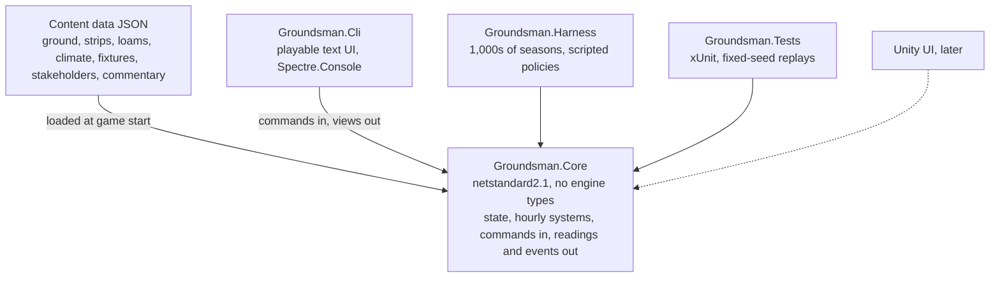
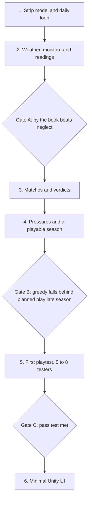

# MVP technical plan

Sep 27, 2026 · @James Fry

The MVP is one playable season at one county ground: a plain C# simulation core, played first through a text front end, with a thin Unity UI added only once the loop tests as fun.

## Goal and pass test

The MVP exists to answer the slice's one question: is rotating strips while balancing pressures fun across a full season? Anything that doesn't help answer it waits.

Scope is the slice as written: one county ground, 12 strips, one April to September season, three formats, captain, board and match referee, an imperfect forecast, readings at two levels, and text commentary with a pitch rating.

| Playtest question | What would show a yes |
| --- | --- |
| Do players plan strips ahead? | They say which strip is for which fixture two or more fixtures out |
| Do readings drive decisions? | They take readings before key jobs, and change plans after one |
| Do the pressures force real choices? | They turn down some stakeholder requests on purpose |
| Are verdicts readable? | They can explain why a pitch played the way it did |
| Does the pace hold? | Few long runs of just pressing advance; the season ends in a sitting or two |

The gate to Unity work: most of 5 to 8 testers finish the season, can explain at least one verdict, and ask to play another.

## Architecture

One Git repo and one solution. The core owns every rule and all state; front ends only send commands and render views, so the Unity UI later is a new client, not a rewrite.



The proposal is to make the first playable a text UI in Groundsman.Cli rather than Unity. Rules will change daily during testing, and a Spectre.Console screen of tables and colour can keep up with that where a Unity UI would need rework each time. Only the core is held to .NET Standard 2.1 and Unity's C# level; the Cli, Harness and Tests can target current .NET.

The core's public surface stays small:

```csharp
public interface IGame
{
    GameView View { get; }
    CommandResult Submit(IGameCommand command);
    AdvanceResult Advance();
}
```

`Advance` runs hourly ticks until the next decision point, which the variable pace rules decide: a week off-season, a day in season, half-days in a strip's final prep, sessions on match day. `GameView` is a read-only snapshot built from readings, never from true state.

## Simulation systems

The MVP runs every system at the Standard setting of the soil science scale, and keeps each one as simple as the playtest questions allow.

| System | State it owns | MVP depth |
| --- | --- | --- |
| Calendar and pace | Date, hour, next decision point | Hourly tick; turn length from the variable pace table |
| Weather | Hourly rain, temperature, wind, sunshine | Generated from monthly climate normals for the fictional ground, rain in spells. Forecast = truth plus noise that grows with lead time |
| Moisture | Surface and subsurface water % per strip | Two-layer bucket: rain and watering in, evaporation out, drainage set by clay content. Covers stop rain |
| Compaction and hardness | Compaction index and hardness per strip | Rolling adds compaction only inside a moisture window; hardness follows compaction and dryness |
| Grass | Cover %, height, root depth | Growth from month, temperature and moisture; mowing sets height |
| Wear and recovery | Damage per zone (ends, footholes, rough), days to recover | Matches add damage by format and length; end repairs plus time bring it back |
| Tasks and staff | Task queue, staff hours per day | Player plus two groundstaff. Water, roll, mow, cover, uncover, repair ends and take readings each cost hours |
| Fixtures | Format, date, assigned strip | Season list from data across the three formats; player assigns strips |
| Stakeholders | Satisfaction per stakeholder, open requests | Captain asks for a pitch character per fixture, board wants length and gate income, referee rates |
| Match | Session pitch characteristics, result summary | See the match model below |

Each hour runs in a fixed order: weather, covers, moisture, grass, tasks in progress, wear and recovery. A fixed order keeps runs reproducible and makes bugs traceable to one step.

The moisture step is a starting point to tune, not a claim about real soil. For each strip's surface layer each hour:

```latex
\theta_s' = \theta_s + R(1 - c) + W - E - D_s
```

θs is surface moisture, R rainfall, c 1 when covered, W watering, E evaporation from temperature, wind, sun and grass cover, and Ds drainage to the subsurface layer, faster for low clay content. The subsurface layer takes Ds in and drains slowly to the profile below.

## Truth and readings

The core keeps two separate stores: true strip state, which only the systems touch, and a knowledge store of readings, which is all the view can see. Building this split in from day one matters more than any other structural choice, because the information mechanic shapes the whole UI.

A reading is a range with an age. Its width starts from the tool, is scaled by who took it, and widens each day after it was taken, faster in changeable weather. The forecast uses the same range type.

```csharp
public readonly struct ValueRange
{
    public ValueRange(double low, double high) { Low = low; High = high; }
    public double Low { get; }
    public double High { get; }
}

public sealed class Reading
{
    public StripId Strip { get; }
    public Quantity Quantity { get; }
    public ValueRange Range { get; }
    public GameTime TakenAt { get; }
    public ReadingSource Source { get; }
}
```

| MVP level | What it reads | How it shows |
| --- | --- | --- |
| Feel (screwdriver and thumb) | Moisture and hardness | Words such as dry, damp or wet, each mapped to a wide band |
| Moisture probe | Surface moisture | A % band, for example 18 to 26% |

Widths, the skill multiplier and the ageing rate all live in data so they can be tuned between playtests. Ground familiarity stays fixed in the MVP, since it only moves across seasons.

Decided: the true value usually sits inside the range but occasionally falls outside it, more often for less skilled staff and older readings, so who takes a reading matters. The miss rate per source lives in data for tuning.

A debug flag in the Cli shows true values beside readings. That is the fastest way to check whether a confusing verdict came from the rules or from the information layer.

## Match and rating model

Matches are simulated session by session, not ball by ball. That is enough to produce the day-one seam, day-four spin arc and the text feed, and it keeps the model small enough to reason about when a verdict looks wrong.

Each session:

1. Derive the pitch characteristics from true strip state, using the drivers in the pitch behaviour table: pace, bounce height and consistency, carry, seam, spin, cracking.
2. Resolve runs and wickets from those characteristics against the bowling attack's profile (seamers and spinners, left or right arm) and the format's overs.
3. Apply wear: footholes and rough by attack profile, surface drying from weather. Late-match spin should come out of this step rather than being scripted.
4. Let weather take overs, with the covers state deciding how much moisture gets in.
5. Raise commentary events when a characteristic crosses a threshold, such as uneven bounce from one end or dust appearing.

Commentary comes from templates in data, keyed by event and filled with the fictional names, so tone can be rewritten without code changes.

At the end the match referee rates the pitch on the ICC scale from [the research notes](research.md) (very good, good, average, below average, poor, unfit), with demerits as set out there. Bounce consistency and danger carry the most weight, then balance between bat and ball over the match. Stakeholder reactions follow from the rating, the result and how long the match lasted.

Out of the MVP: ball-by-ball play, named individual players, pitch maps and bounce heatmaps.

## Content, saves and determinism

All tuning numbers live in JSON so a playtest round can change balance without a rebuild.

| File | Holds |
| --- | --- |
| `ground.json` | Ground name, the 12 strips and their starting soil, outfield drainage |
| `loams.json` | Clay %, drainage rate, cracking tendency |
| `climate.json` | Monthly normals: rain days and totals, temperature, sunshine, wind |
| `fixtures.json` | Date, format, opposition, attack profile |
| `stakeholders.json` | Request rules and satisfaction weights for captain, board, referee |
| `readings.json` | Tool widths, staff skill multipliers, ageing rates |
| `commentary.json` | Event templates |

Newtonsoft.Json may be the easier serialiser in the core, since Unity ships it as a package and System.Text.Json takes extra work to bring into Unity.

**Saves.** One versioned JSON file holding game state, the knowledge store and the random generator state, with a `schemaVersion` field and a migration function per version bump. In the MVP saves mostly let testers stop and resume, and give you an exact bug report: the tester sends the save.

**Determinism.** Rules that follow from the constraints already in the doc:

- The core's own seeded generator (a small PCG or xoshiro implementation), not `System.Random`, with its state saved.
- A separate stream per system (weather, match, events), so adding a roll to the match model doesn't shift the weather in every test seed.
- No wall-clock time, and no logic that depends on dictionary iteration order.
- Exact replays are guaranteed on one machine; identical results across Mac and Windows are not an MVP goal.

## Testing and balancing

The harness can tell you whether the core puzzle exists before anyone plays: if a greedy policy does as well as a planned one, strip rotation doesn't matter yet, and no UI will fix that.

**Unit tests** hold invariants per system: moisture stays between zero and saturation, a covered strip takes no rain, rolling outside the moisture window adds no compaction, a neglected strip rates worse than a prepared one.

**Fixed-seed replays** run a seed plus a scripted command list and compare the end state against a stored snapshot, so any unintended rule change shows up.

**Harness policies**, each run over 1,000 seeded seasons with results written to CSV:

| Policy | Plays like | Should end up |
| --- | --- | --- |
| Neglect | Does nothing but assign strips | Frequent demerits and unhappy stakeholders |
| By the book | Follows the ten-day prep loop from [the research notes](research.md) | Few below-average ratings |
| Greedy | Always picks the best-looking strip now | Strong early, short of good strips late in the season |
| Random | Random legal commands | A baseline that proves the others differ |

**Playtest telemetry.** The Cli writes a local JSON Lines log: commands, readings taken, requests accepted or turned down, advance presses and time per turn. Each field maps to a row in the pass test above. Testers send the log and their save with a short post-season questionnaire.

## Milestones

The phases follow the build order in the design tab, with the readings layer pulled forward into phase 2 and a playtest added before any Unity work.



Gates A and B are harness checks you run alone; only Gate C needs people. At about 10 hours a week, rough estimates, given as ranges since they are guesses:

| Phase | Hours | Weeks at 10 h |
| --- | --- | --- |
| 1 · Strip model and daily loop | 30 to 40 | 3 to 4 |
| 2 · Weather, moisture and readings | 50 to 70 | 5 to 7 |
| 3 · Matches and verdicts | 40 to 60 | 4 to 6 |
| 4 · Pressures and a playable season | 60 to 80 | 6 to 8 |
| 5 · First playtest | Mostly waiting on testers | 2 to 4 |
| 6 · Minimal Unity UI | 60 to 80 | 6 to 8 |

That puts the first playtest roughly 5 to 7 months out, and a Unity build 2 months after that. Phase 2 carries the most tuning risk, so it is the likeliest to run long.

## Risks and open questions

| Risk | Fallback |
| --- | --- |
| Testers judge the text UI, not the loop | Recruit people who already play management sims, and brief them that looks come later |
| Verdicts feel random because the soil model is opaque | Tie every commentary event to a named cause; use the truth debug view to find where the chain breaks |
| Session-level matches are too coarse to show foothole effects | Split sessions into 10-over steps inside the same model |
| Work drifts into minigames or career before Gate C | Anything outside the slice list waits for the pass test |
| Unity's C# level blocks features the core wants | Check new language features against Unity 6 before using them in the core |

- [x] Hours per week for the project, to put durations on the phases
- [x] Readings: truth always inside the range, or occasional misses?
- [ ] Where the 5 to 8 testers come from
- [ ] Number of home fixtures in the MVP season
- [x] Tester builds: the Cli can be published self-contained for Mac and Windows from the Mac; is Windows needed for the first round?

Tester builds go out for Mac and Windows. You develop and test on the Mac, and check each Windows build yourself in a Windows 11 VM (Parallels is the smoothest) before it goes to testers. The Cli publishes self-contained for both from the Mac. Windows testers then cover what a VM can't: real x64 hardware, GPU drivers and performance, which matters more once the Unity UI arrives.
